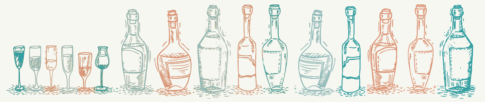

```{r setup, echo=FALSE, results='hide', message=FALSE, warning=FALSE}
# Če želimo nastaviti pisave v PDF-ju, odkomentiramo
# in sledimo navodilom v programu.
#source("fontconfig.r", encoding="UTF-8")

# Uvoz vseh potrebnih knjižnic
source("lib/libraries.r", encoding="UTF-8")
```

```{r rstudio, echo=FALSE, results='asis'}
# Izris povezave do RStudia na Binderju
source("lib/rstudio.r", encoding="UTF-8")
```

# Izbira teme

Za temo sem izbrala **alkoholno industrijo**. Nisem se omejila na posebnem geografskem področju. Ampak večina podatkov je za evropske države, ker jih je enostavno dobiti. 

Ta projekt bo vključeval analizo te panoge iz več vidikov.
Prikazala bom proizvodnjo alkohola in količino uvoza oz. izvoza za posamezno državo. Vklučila bom podatke povezane z ceno alkohola. Želim prikazati ali so cene odvisne od življenskega standarda v dani državi. Zaradi tega bom vključila še eno ekonomsko spremenljivko: BDP. Našla sem tudi podatke o količinah proizvedenega alkohola po kategorijah vrsti pijač: pivo, gin, vodka, rum, whisky. Sem ogledala tudi podatke o konzumaciji alkohola. Tukaj bom ugotovila katera država konzumira največ (najmanj) alkohola. Ta analiza bo vsebovala podatke po spolu, starosti in frekfenci konzumacije. Vse te podatke bom prikazala na različnih načinih skozi različne dimenzije. Potem se bom osredotočila na porabljeno količino alkohola prebivalca. Vir teh podatkov bo html tabela iz Wikipedije, katera vsebuje skoraj vse države. Na koncu pa bom naredila še eno analizo ki se bo nanašala na prihodnost. Torej bom napovedala prihodnjo proizvodnjo alkohola.  



***

# Obdelava, uvoz in čiščenje podatkov

```{r uvoz, echo=FALSE, message=FALSE, warning=FALSE}
source("uvoz/uvoz.r", encoding="UTF-8")
```

Uvozila sem podatke o kolicini alkohola na prebivalca iz *Wikipedija* v HTML obliki. Vse ostale podatke, cene, frekfenca konzumacije, kolicina konzumacija, proizvodnja alkohola, sem dobila iz spletne strani *Eurostat* v obliki CSV. 

Podatke imamo v štirih razpredelnicah v obliki *tidy data*.

1. `kolicina_pc` - podatki o kolicina alkohola per capita za 2010 po države
  - `Countries` - spremenljivka: ime države (character),
  - `Total alcohol` - meritev: število ispien alkohol v liter (numeric),
  - `Beer(%)` - meritev: število kolicina piva v procentih  (numeric),
  - `Wine(%)` - meritev: število kolicina vina v procentih  (numeric),
  - `Spirits(%)` - meritev: število kolicina spirits v procentih  (numeric),
  - `Other(%)` - meritev: število kolicina ostale alkohole v procentih  (numeric).

2. `Kolicina` - podatki o kolicina alkohola za leto 2010 po države
  - `Country` - spremenljivka: ime države (character),
  - `Frequency` - spremenljivka: frekfenca na konzumacije alkohola (character),
  - `Sex` - spremenljivka: spol (character),
  - `65 years and older` - meritev: število konzumacija ljudi 65+ let v procentih,
  - `From 15 to 24 years` - meritev: število konzumacija ljudi 15-24 let v procentih,
  - `From 25 to 64 years` - meritev: število konzumacija ljudi 25-64 let v procentih
  - `Total` - meritev: vsota prejšnji 3 stolpcov.
  
3. `Cene` - podatki o cene alkohola po države
  - `Country` - spremenljivka: ime države (character),
  - `Year` - spremenljivka: leto  (numeric),
  - `Type` - alkohol (character),
  - `Value` - meritev: število sprememba cene alkohola (Price level indices (EU28=100)) (numeric).
  
3. `Production` - podatki o proizveden, uvozen, izvozen alkohol po države
  - `Country` - spremenljivka: ime države (character),
  - `Year` - spremenljivka: leto  (numeric),
  - `Type of alcohol` - vid alkohol (character),
  - `Exports` - meritev: število izvozen alkohol (numeric),
  - `Imports` - meritev: število uvozen alkohol (numeric),
  - `Production` - meritev: število proizveden alkohol (numeric).
  
4. `Gdp_per_capita` - bdp per kapita po državah, 
  - `Year` - spremenljivka: leto  (numeric),
  - `Value` - meritev: število bdp per capita (Price level indices (EU28=100)) (numeric).
  
**Opomba**: Da bomo imeli pounčikovite tabele, tabela `production` razcepimo na tri dela: `table_exports`, `table_imports` in  `table_production`.

***

# Analiza in vizualizacija podatkov

```{r vizualizacija, echo=FALSE, message=FALSE, warning=FALSE, results='hide'}
source("vizualizacija/vizualizacija.r", encoding="UTF-8")
```

Spodnji graf prikazuje 6 evropskih držav (Bolgarija, Finska, Romania, Španija, Sviča in Združeno Kraljevstvo) skozi njihovi BDP (črtkane linije) in cene alkohola (navadne linije). Prikazana je sprememba cen in BDP prebivalca po letih, od 2008-2018. Vse to je prikazano skozi indeske cen (Price level indices) z referenco EU28 = 100. To pomeni primerjava raven cen v navedenih drzavah v primerjavi z izbrano osnovo. V našem primeru so cene izražene glede na povprečno raven cen v EU-28. Če je vrednost indeksa za državo višja (nižja) od 100, to pomeni, da je raven cen v državi višja (nižja) od povprečne ravni cen v EU-28, to je, da je država dražja (cenejša)

```{r graf_cene, echo=FALSE, fig.align='center', warning=FALSE, fig.cap='Graf 1'}
graf_cene
```

Je jasno in razumljivo da Španija, Bolgarija in Romunija nahajajo pod povprečjem EU. Te države imajo bolj stabilne cen od ostalih. Lahko vidimo, da med letoma 2010 in 2013 je Španija imela nižji rast BdP-ja in se na to cene odzivale nasprotno, torej so padale. Iz slike lahko ugotovimo, da med 2014 in 2017, so se cene alkohola v ZK dramatično spremenile ampak BDP je ostal skoraj nespremenjen Če pogledamo Švico in ZK v intervalu med 2013 in 2015, se vidi da sta njuni BDP imajo skoraj identični smerni koeficient. Torej BDP raste enako hitro. Po drugai strani pa njihove cene se ne ujemajo med sabo. Funkcija cen za ZK na tem intervalu je naraščajoča, a za Švico je najprej padajoča pa potem naračšajoča. Iz tega sklepamo, da niso cene alkohola odvisne od sprememba BDP-ja.

Nasljedni graf nam pokaže proizvodnjo alkohola v Evropskih državah. Torej proizvodnja pomeni koliko litrov alkohola so se prozvajali v dano leto. Sklepamo da se v Evropskih državah največ proizvaja pivo, najmanj pa rum in gin. Razlika med proizvedenimi pivi in ostale pijačami je vedno velika. Je razvidno, da je leto 2014 najbolši period za proizvodnjo piva, 2017 pa za viski. Proizvodnja vodke in gina je povsvod skoraj enaka. Lahko sklepamo da je stabilna.

```{r graf_proizvodnja, echo=FALSE, warning=FALSE, fig.align='center', fig.cap='Graf 2'}
graf_proizvodnja
```

Spodnji zemljevid prikazuje koliko alkohola se konzumira v 191 različnih državah. Države z najmanjšim procentom konzumacije na prebivalca so obarvane temno, tiste z največi pa svetlo modro.

```{r zemljevid_kolicina_alkohola, echo=FALSE, warning=FALSE, fig.align='center', fig.cap='Zemljevid 1', fig.width=10,fig.height=7}
zemljevid_kolicina_alkohola
```

Vidno je, da severni del Afrike, bliski Istok pa Okeanija držijo najmanjši procent konzumiranega alkohola. Nasprotno Rusija, Belorusija in Moldavija so države v kateri se pije največ. 

Na nasljedni sliki sem prikazala en kombiniran graf, ki prikazuje konzumacija različnih pijačah na prebivalca. Zelo je zanimivo je kako se svet deli v odvisnosti od pijače. Lahko sklepamo da za pivo ne obstaja neki vzorec ki pove v kateri geografski položaj so največi številki. Lahko rečemo sam da države v Južni Ameriki, Evropa pa še neke v Afriki imajo največi procent kozumacije piva. Po drugi strani pa so žgane pijače ki zavzamejo veliki procent v konzumaciji azijske države. Iz te se ločujejo: Haiti, Saudiska Arabija in Severna Koreja. Zadnja kategorija je vino. Seveda, najsvetlo barvo imajo evropske države, ker tam se uživa največ vina. 

```{r zemljevid_kolicina, warning=FALSE, echo=FALSE, fig.width=11,fig.height=15, fig.align='center', fig.cap='Zemljevid 2'}
zemljevid_kolicina
```

Nasljedna stvar, katera sem hotela prikazati, je konzumacije pijače v Evropi, s strani mladih.  

```{r zemljevid_kolicina_alkohola_mlade, warning=FALSE, echo=FALSE, fig.align='center', fig.cap='Zemljevid 3', fig.width=10,fig.height=7}
zemljevid_kolicina_alkohola_mlade
```

Torej v sliki se vidi da Norveška, Iceland in Litva imajo največi procent na mladih ljudi ki pijejo vsaki mesec. Pomembno je to da se podatki nanašajo na mesečna konzumacija. Portugalska in Združeno Kraljevstvo so najtemno obarvane, kar pomeni da tem mladih ne pijejo alkohol veliko.   


# Napredna analiza podatkov

```{r analiza, echo=FALSE, message=FALSE, warning=FALSE, results='hide'}
source("analiza/analiza.r", encoding="UTF-8")
```

Tuki sem analizirala konzumacije alkohola skozi spol. Izbrala sem si 4 države, vsaka iz različnega konca Evrope. Vsi vemo da južne države pijejo več alkohola. Ampak ta analiza prikazuje, da prebivalci Irske in Norveške, ki imata bolj zapadno severni položaj,  konzumirajo več alkohola kot ostale. Iz te slike se tudi da zaključiti, da moške pijejo več od ženske povsod.

```{r graf_spol, echo=FALSE, warning=FALSE, message=FALSE, fig.align='center', fig.cap='Graf 3'}
graf_spol
```

Nasljedni graf je tri dimenzionalna analiza (3x2x5). Prikazuje količina alkohola v Sloveniji za dve letne kategorije: Ljudi od 25-64 let in nad 65 let. Te dve kategoriji sta še razdeljeni po spolu: Moški, Ženske in skupaj. Zdaj vse to lahko pogledamo po frekfenca konzumacije. To pomeni pitje dnevno, nedeljno, mesečno in tako naprej. 

```{r graf_slovenija, echo=FALSE, warning=FALSE, message=FALSE, fig.align='center', fig.cap='Graf 4'}
graf_slovenija
```

Tukaj največje število konzumacije alkohola na tedenskem nivju jimajo moški med 25-64 let. Lahko vidimo da veliki procent zavzamejo starejši moški ki pijejo vsak dan. Zanimljivo je da ženske ki so 65+ let na mesečno nivo pijejo več kot moških.  

Nasljedna analiza je sestavljena iz linearne regresije, z katere sem napovedala proizvodnja. Vključene so tri države: Bugarija, Finska in Litva. Sem izbrala te države ker so imeli drugačne podatke. Opazovane podatke so vsi vrednosti od leta 2008-2013. Naslenjde vrednosti za leta 2014-2020 pa napovedujemo, z pomočjo ustreznem modelu. Rdeče pikice so pravi vrednosti za leto 2014-2018, modra linija je regresijska premica in črne pikice so vrednoste ki vemo za 2008-2013. Model pravi da v leta 2014-2020 lahko pričekujemo da bo proizvodnja neko število ki je na ta modra premica. 

```{r graf_regresija_pivo, echo=FALSE, warning=FALSE, message=FALSE, fig.align='center', fig.cap='Graf 5'}
graf_regresija_pivo
```

Prvi graf vsebuje te tri (prej omenjene) države in proizvodstva piva. Recimo za Finska, naš model zelo dobro napoveduje, ker rdečo pikico v 2015 in 2018 je skoraj na naši premici. Na drugo stran pa je Litvanija za katera ta model ni dober.  

Spodaj pa je še en graf, tokrat za proizvodnja viskija. Tuki za Finska smo dobili na nek način nepričekovan napoved. Nasprotno pa od prejšnji graf, litvaniski model je dosta dobar in daje resnične vrednosti.

```{r graf_regresija_viski, echo=FALSE, warning=FALSE, message=FALSE, fig.align='center', fig.cap='Graf 6'}
graf_regresija_viski
```

***

# Zaključek

Od vse podatke sem zaključila da ponavadi napačno sklepamo stvari v zvezi s to industrijo. Videli smo da cene niso odvisne od zivljenskega standarda in da so manj stabilne v bolj razvite države. Tudi sem ugotovila da severne države imajo večjo konzumacijo od ostale, ki je na nek način nenavadno. Podatki o koznumacija po spol prikazujejo, da konzumacija moške in ženske se zelo razlikuje. Sam manj državah imajo skoraj isto konzumacijo po spola. V splošnem evropske države so tisti z največo število litrov alkohola na prebivalca. Nasproti pa so afriške države ki imajo največi procent konzumacije piva. Zelo nepričekovane so bili podatki o konzumacije v Evropi, s strani mladih. Tem sem ugotovila da v južne države mladih ljudi ne pijejo veliko ki je spet nenavadno. Glede na vse, analizo te panoge pretstavlja široko polje sestavljeno iz različne spremenljivke.  